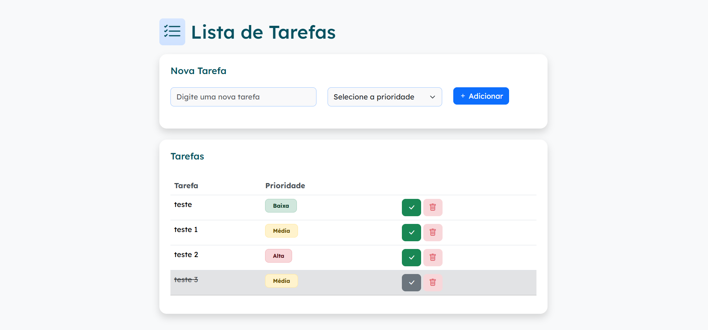

# 📝 Lista de Tarefas

Projeto desenvolvido com **HTML**, **CSS** (estilizado com **Bootstrap**) e **JavaScript puro**, com armazenamento no `localStorage`.  
Permite adicionar tarefas, definir prioridade, marcar como concluídas e excluir com confirmação.  
💡 Projeto desenvolvido como parte da **avaliação do bootcamp da SoulCode Academy**.


## 🔗 Deploy

Acesse o projeto publicado aqui: [🔗 Link do projeto no ar](https://jhenifferaraujo20.github.io/lista-de-tarefas/)


## ✨ Funcionalidades

- ✅ Adicionar novas tarefas com prioridade (Alta, Média, Baixa)  
- 🎯 Marcar e desmarcar tarefas como concluídas  
- 🗑 Excluir tarefas com confirmação por modal  
- 💾 Salvamento automático no navegador com `localStorage`  
- 🎨 Interface moderna com **Bootstrap 5** + ícones do **Bootstrap Icons**  
- 🛑 Exibição condicional da lista e mensagens amigáveis quando estiver vazia  

## 📸 Preview




---

## 🚀 Tecnologias Utilizadas

- HTML5  
- Bootstrap 5  
- JavaScript   


## 🛠 Como usar

1. Clone este repositório:

```bash
git clone https://github.com/jhenifferaraujo20/lista-de-tarefas.git
```

2. Navegue até a pasta do projeto:

```bash
cd lista-de-tarefas
```

3. Abra no navegador:
```bash
start index.html
```

## 🧠 Aprendizados

Este projeto me ajudou a consolidar conceitos de:

- Manipulação do DOM
- Eventos com `addEventListener`
- Operações em arrays com `map`, `filter`
- Uso de `localStorage`
- Uso de Bootstrap com classes utilitárias

## 💡 Próximos passos (sugestões)

- Separar tarefas pendentes e concluídas em cards diferentes  
- Adicionar filtro por prioridade  
- Modo escuro (Dark Mode)  
- Melhorar responsividade mobile  
- Refatorar JS em módulos  

## 🧑‍💻 Desenvolvido por

**Jheniffer Araújo** 💜  
[LinkedIn](https://www.linkedin.com/in/jheniffer-araujo-baldi/)